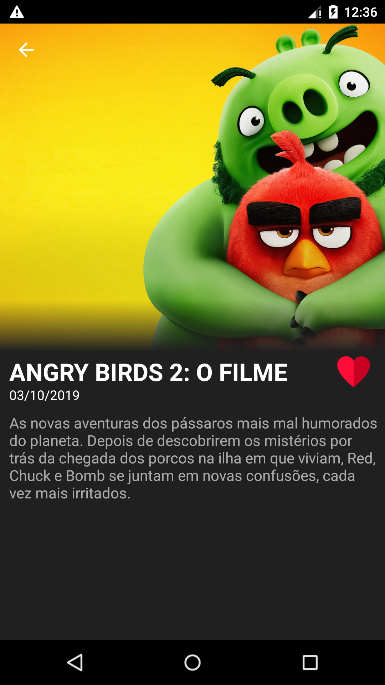
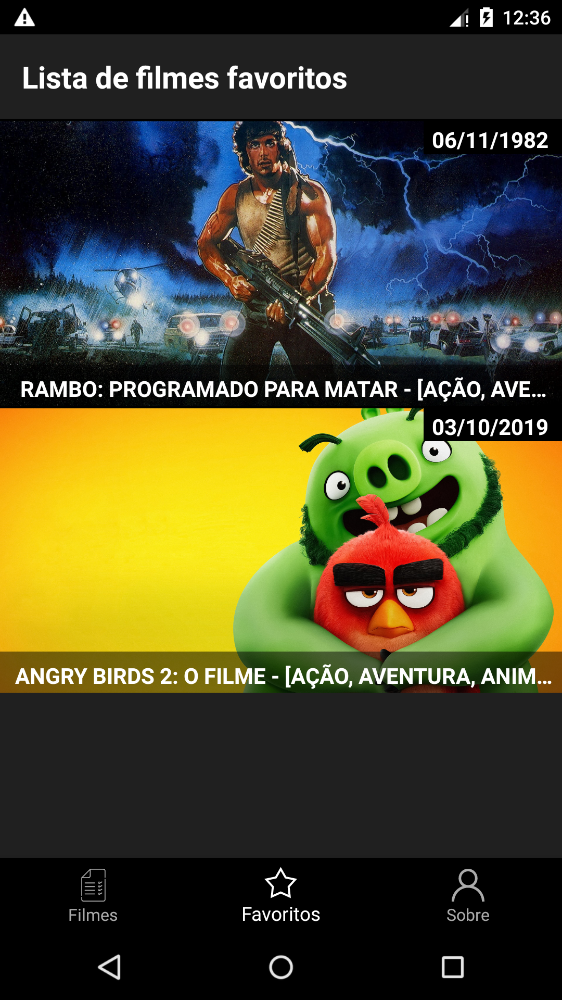

# SearchMovie

### Screenshots

### Description

Movie application that consumes MovieDb API.

### Using
- Kotlin
- AndroidX
- Architecture Component(Lifecycle and ViewModel)
- Room
- Retrofit
- OkHttp
- Rx
- Glide
- Koin
- Junit
- Mockito
- Clean Architecture

